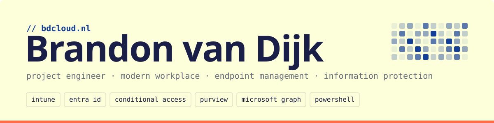

<picture>
  <source media="(prefers-color-scheme: dark)" srcset="./assets/banner-dark.svg">
  
</picture>

Project Engineer at [UNO Automatiseringdiensten](https://uno.nl), specialised in Microsoft Modern Workplace, Endpoint Management and Information Protection. I build tooling that turns repetitive tenant work into repeatable, version-controlled automation.

### Certifications

    

### Elsewhere

- Blog & portfolio: [bdcloud.nl](https://bdcloud.nl)
- LinkedIn: [brandon-van-dijk](https://www.linkedin.com/in/brandon-van-dijk/)

<picture>
  <source media="(prefers-color-scheme: dark)" srcset="https://raw.githubusercontent.com/Bradryx/Bradryx/output/github-snake-dark.svg">
  
</picture>
